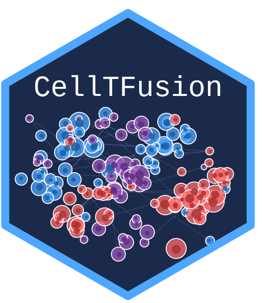

# CellTFusion <a href="https://verapancaldilab.github.io/CellTFusion/"></a>

Integration of immune-cell type deconvolution features and
prior-knowledge networks of TFs-gene interactions to characterize
potential cell states of the tumor microenvironment using bulk RNAseq
data

<!-- badges: start -->
<!-- badges: end -->
<p align="center">

</p>
<p align="center">
<em>Figure 1. A schematic overview of the `CellTFusion` pipeline</em>
</p>

## Installation

To avoid GitHub API rate limit issues during installation, we recommend
setting up GitHub authentication by creating and storing a Personal
Access Token (PAT). You can do this with the following steps:

``` r
# install.packages(c("usethis", "gitcreds"))
usethis::create_github_token() #Create a Personal Access Token (if you don't have)
gitcreds::gitcreds_set() #Add the token
```

You can install the development version of `CellTFusion` from
[GitHub](https://github.com/) with:

``` r
# install.packages("pak")
pak::pkg_install("VeraPancaldiLab/CellTFusion")
```

## Launch the Shiny app

You can run the CellTFusion Shiny interface in two ways.

From an installed package:

``` r
library(CellTFusion)
shiny::runApp(system.file("shiny", package = "CellTFusion"))
```

From this source repository:

``` r
shiny::runApp("inst/shiny")
```

In the app, click **Load tutorial data** for a quick demo, then click
**Run CellTFusion**. Results and downloadable files are written to your
working directory.

## General usage

These are basic examples which shows you how to use `CellTFusion` for
different tasks. For a detailed tutorial, see [Get
started](https://VeraPancaldiLab.github.io/CellTFusion/articles/CellTFusion.html)

Before running `CellTFusion`, make sure to set your working directory.
The `Results/` folder, where outputs will be saved, will be created in
this directory.

``` r
setwd('~/path/to/directory')
library(CellTFusion)
```

If you want to run the full pipeline in one step — including
normalization, deconvolution, TF activity scoring, module construction,
and pathway scoring — use the `CellTFusion()` wrapper function.

``` r
res <- CellTFusion(
  raw.counts = raw.counts,
  normalized = TRUE,
  coldata = traitdata, # Optional metadata
  task = "unsupervised",                          # or "supervised"
  deconv_methods = c("Quantiseq", "DeconRNASeq"), # Choose from Quantiseq, Epidish, DeconRNASeq, DWLS, CBSX
  cbsx.mail = "your_email",       # Required if using CBSX (CIBERSORTx)
  cbsx.token = "your_token",      # Required if using CBSX (CIBERSORTx)
  TF.collection = "CollecTRI",    # "CollecTRI", "Dorothea", or "ARACNE"
  cancer_type = "skcm",           # TCGA cancer type, used for meta-program mapping
  file_name = "TestRun",
  min_targets_size = 15,
  minMod = 20,
  corr_mod = 0.25,
  corr = 0.7,
  pval = 0.05,
  return = TRUE
)
```

For supervised analysis (comparing two clinical groups), set `task = "supervised"` and provide `contrast` (the column in `coldata` defining the comparison) and `ref_level` (the reference/baseline level). This requires non-normalized (raw) counts, since it runs differential expression analysis internally:

``` r
res <- CellTFusion(
  raw.counts = raw.counts,
  normalized = FALSE,
  coldata = traitdata,
  task = "supervised",
  contrast = "Best.Confirmed.Overall.Response",
  ref_level = "PD",
  deconv_methods = c("Quantiseq", "DeconRNASeq"),
  file_name = "TestRun_supervised",
  return = TRUE
)
```

**NOTE**: `CIBERSORTx` is included in the deconvolution methods, but
it’s not an open-source program. To run it, please ask for a token in
[CIBERSORTx](https://cibersortx.stanford.edu/register.php) and once
obtained, provided your username and password on the parameters
`credentials.mail` and `credentials.token`.

## Output structure

`CellTFusion()` returns a named list with the outputs of each pipeline stage — cell-type deconvolution, TF activity, TF module network, pathway scores, cell groups, latent factors, cell niches, and TME state mapping. Cell groups are derived internally via `construct_cell_groups()` and are available at `res$Cell_groups`:

``` r
res$Cell_groups$Cell_groups  # data frame of cell group scores (samples x groups)
res$Cell_groups$Composition  # cell types included in each group
res$Cell_groups$Weights      # feature loadings per group
```

For a step-by-step walkthrough of every pipeline stage, see the [Get started](https://VeraPancaldiLab.github.io/CellTFusion/articles/CellTFusion.html) vignette and the [articles](https://VeraPancaldiLab.github.io/CellTFusion/articles/) section.

## Replicate cell groups on an independent dataset

Use this function to apply the trained cell groups to an external test
set and calculate group-specific composite scores.

``` r
test_scores <- compute.test.set(
  deconv_res = deconv_res_test,
  cell_groups = cell_groups,
  features = selected_features,
  deconvolution_test = deconv_matrix_test
)
```

## Issues

If you encounter any problems or have questions about the package, we
encourage you to open an issue
[here](https://github.com/VeraPancaldiLab/CellTFusion/issues). We’ll do
our best to assist you!

## Authors

`CellTFusion` was developed by [Marcelo
Hurtado](https://github.com/mhurtado13) in supervision of [Vera
Pancaldi](https://github.com/VeraPancaldi) and is part of the
[Pancaldi](https://github.com/VeraPancaldiLab) team. Currently, Marcelo
is the primary maintainer of this package.

## Citing `CellTFusion`

If you use `CellTFusion` in a scientific publication, we would
appreciate citation to the :
