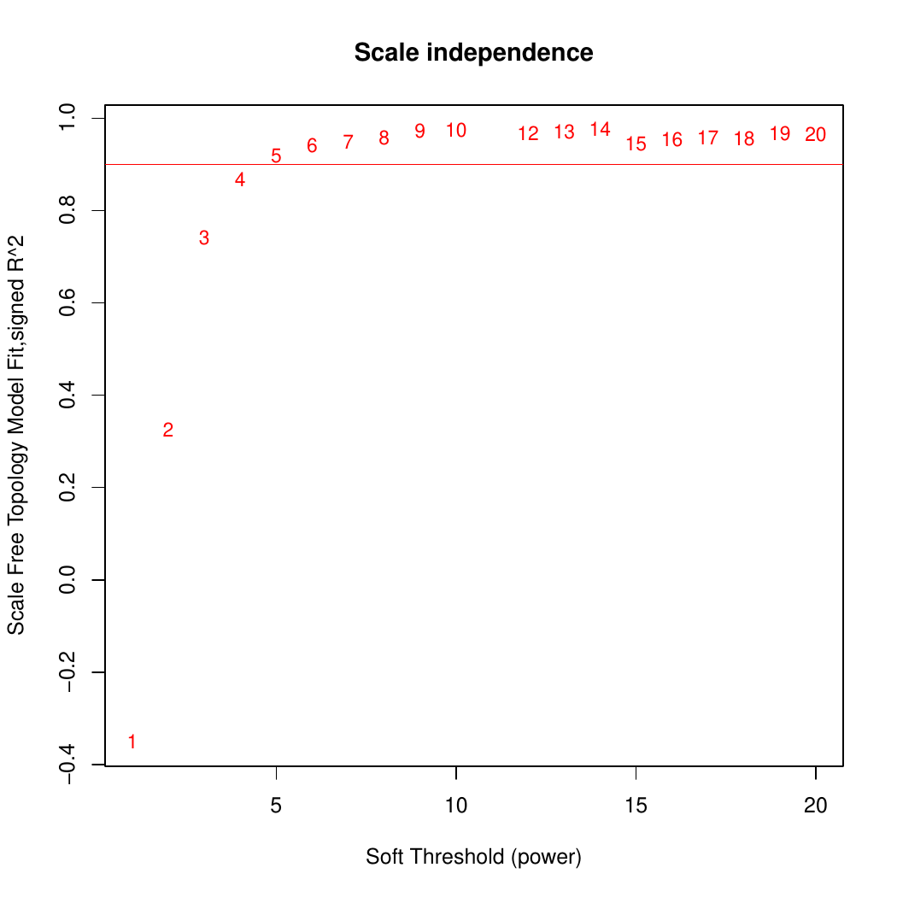
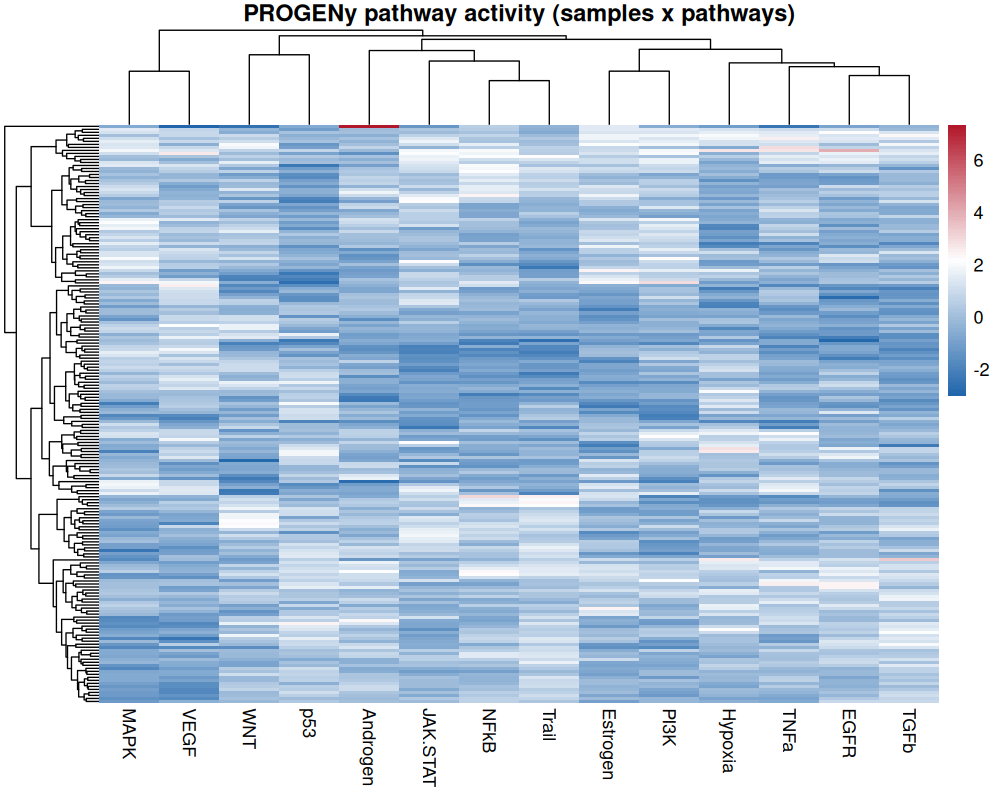

```{r, include = FALSE}
knitr::opts_chunk$set(
  collapse = TRUE,
  comment = "#>"
)
```

```{r setup}
library(CellTFusion)
```

`CellTFusion` combines two families of features computed from bulk RNA-seq data: **cell type deconvolution** and **transcription factor (TF) activity**, the latter summarized into TF co-activity modules. Pathway activities are computed alongside. This tutorial runs each step on its own, with its key arguments and outputs. All of them are run automatically, in this order, by the `CellTFusion()` wrapper (see [Running the full pipeline](#running-the-full-pipeline)).

Load the example data:

```{r}
raw.counts <- CellTFusion::raw.counts.tuto
traitdata  <- CellTFusion::traitdata.tuto
```

## **Normalization**

TF and pathway activities are computed from log2-transformed TPM values. Deconvolution methods use TPM without the log transform; this is handled internally by `compute.deconvolution()`.

```{r, eval = FALSE}
counts.norm <- data.frame(ADImpute::NormalizeTPM(raw.counts, log = TRUE))
```

## **Cell type deconvolution**

Cell type proportions are estimated with `compute.deconvolution()` from the companion package [`multideconv`](https://github.com/VeraPancaldiLab/multideconv), which runs several deconvolution methods (Quantiseq, Epidish, DeconRNASeq, DWLS and CIBERSORTx) with multiple signatures. The result is a matrix of samples x method-signature-cell type features.

Key arguments:

- `raw.counts` — count matrix (genes x samples).
- `methods` — deconvolution methods to run.
- `normalized` — whether to TPM-normalize the counts before deconvolution.
- `credentials.mail` / `credentials.token` — CIBERSORTx credentials, only needed if `"CBSX"` is in `methods`.
- `return` — if `TRUE`, saves the matrix in `Results/`.

```{r, eval = FALSE}
deconv <- multideconv::compute.deconvolution(
  raw.counts,
  methods    = c("Quantiseq", "Epidish"),
  normalized = TRUE,
  return     = FALSE
)
```

## **TF activity**

`compute.TFs.activity()` infers the activity of each TF in each sample from the expression of its targets, using the consensus score of `decoupleR` [@10.1093/bioadv/vbac016] and a TF-target network (regulon).

Key arguments:

- `RNA.counts` — normalized expression matrix (genes x samples), typically log2(TPM + 1).
- `TF.collection` — source of the regulon:
  - `"CollecTRI"` (default) [@10.1093/nar/gkad841] and `"Dorothea"` are curated regulons fetched from OmnipathR. Each collection is cached in its own file in `Results/` (`TF_target_collection_<collection>.csv`) and reused in later runs.
  - `"ARACNE"` uses a **data-driven, cohort-specific** network inferred with ARACNe [@Margolin2006], which derives TF-target edges from the mutual information between expression profiles across a cohort and removes indirect interactions. This is useful for a large, homogeneous cohort in which curated interactions may not hold. The network is read from `input/ARACNE/<cancer.type>/network/network.txt` (relative to the working directory), a tab-separated file with `Regulator` and `Target` columns; the sign of each interaction is taken from the Spearman correlation between the TF and its target.
- `min_targets_size` — minimum number of targets per regulon; TFs with fewer targets are dropped (default 5).
- `universe` — optional user-supplied regulon (data frame with `source`, `target` and `mor` columns), used instead of fetching one.
- `scale` — if `TRUE` (default), z-scores TF activities across samples.

```{r, eval = FALSE}
tfs <- compute.TFs.activity(
  RNA.counts       = counts.norm,
  TF.collection    = "CollecTRI",
  min_targets_size = 5,
  return           = TRUE
)
```

To use your own regulon:

```{r, eval = FALSE}
universe <- decoupleR::get_collectri(organism = "human", split_complexes = FALSE)
tfs <- compute.TFs.activity(counts.norm, universe = universe)
```

To use a cohort-specific ARACNe network:

```{r, eval = FALSE}
tfs_aracne <- compute.TFs.activity(
  RNA.counts    = counts.norm,
  TF.collection = "ARACNE",
  cancer.type   = "skcm"   # reads input/ARACNE/skcm/network/network.txt
)
```

## **TF co-activity modules**

`compute.WTCNA()` groups TFs with similar activity patterns into **modules** using Weighted TF Co-activity Network Analysis (WTCNA), an adaptation of WGCNA [@langfelder2008wgcna] to TF activities. Each module is summarized by one score per sample, its eigengene.

Key arguments:

- `TFs.matrix` — TF activity matrix (samples x TFs), or a list of per-cohort matrices when `batch = TRUE` (see [Multi-cohort analysis](a6_batch_analysis.html)).
- `network.type` — `"signed"` (default), `"unsigned"`, `"signed hybrid"` or `"distance"`.
- `minMod` — minimum number of TFs per module.
- `corr_mod` — correlation above which module eigengenes are merged.
- `cor_type` — `"p"` (Pearson, default) or `"s"` (Spearman; single-cohort mode only).

```{r, eval = FALSE}
network <- compute.WTCNA(
  TFs.matrix        = tfs,
  network.type      = "signed",
  clustering.method = "ward.D2",
  minMod            = 15,
  corr_mod          = 0.9,
  return            = TRUE
)
```

With `return = TRUE`, diagnostic plots are saved in `Results/`. First, the scale-free topology fit used to choose the soft-thresholding power:

```{r, echo = FALSE, out.width = "70%", fig.align = "center", fig.alt = "Scale-free topology model fit versus soft-thresholding power"}

```

Then the TF dendrogram with module colors, before and after merging highly correlated modules:

```{r, echo = FALSE, out.width = "48%", fig.show = "hold", fig.alt = c("TF dendrogram with module colors before merging", "TF dendrogram with module colors after merging")}
knitr::include_graphics(c(
  "figures/gene_dendrogram_before_merging.png",
  "figures/gene_dendrogram_after_merging.png"
))
```

`network[[1]]` (`"TFs module matrix"`) contains the module scores (samples x modules) used to build cell groups.

## **Pathway activity**

`compute.pathway.activity()` estimates pathway activities with a multivariate linear model from `decoupleR` [@10.1093/bioadv/vbac016] and the PROGENy pathway footprints [@Schubert2018]. If a list of gene sets is given, GSVA scores are computed as well.

Key arguments:

- `RNA.tpm` — normalized expression matrix (genes x samples).
- `gene_sets` — optional named list of gene sets; if provided, GSVA scores are returned in addition to PROGENy.
- `paths` — optional custom PROGENy-style table (`source`, `target`, `weight`); by default the human PROGENy model is used.

```{r, eval = FALSE}
pathways <- compute.pathway.activity(
  RNA.tpm = counts.norm,
  return  = TRUE
)
```

The result is a samples x pathways matrix (14 PROGENy pathways by default). Clustering it gives an overview of which pathways co-vary across the cohort:

```{r, echo = FALSE, out.width = "80%", fig.align = "center", fig.alt = "Heatmap of PROGENy pathway activities clustered by sample and pathway"}

```

## **Reduction of deconvolution features**

Deconvolution features from different methods and signatures are often highly correlated. `compute.deconvolution.analysis()` from `multideconv` groups correlated features of the same cell type into **subgroups**, reducing redundancy before building cell groups.

Key arguments:

- `deconvolution` — output of `compute.deconvolution()`.
- `corr` — minimum correlation to group features into a subgroup.
- `corr_type` — `"spearman"` (default) or `"pearson"`.
- `batch` — optional cohort vector; correlations then control for cohort (see [Multi-cohort analysis](a6_batch_analysis.html)).

```{r, eval = FALSE}
dt <- multideconv::compute.deconvolution.analysis(
  deconvolution = deconv,
  corr          = 0.7,
  return        = FALSE
)
```

## **Running the full pipeline**

`CellTFusion()` runs all the steps above, then builds cell groups and latent factors and characterizes TME states:

```{r, eval = FALSE}
res <- CellTFusion(
  raw.counts     = raw.counts,
  normalized     = TRUE,
  deconv_methods = c("Quantiseq", "Epidish"),
  TF.collection  = "CollecTRI",
  cancer_type    = "skcm",
  corr           = 0.7,
  corr_mod       = 0.9,
  pval           = 0.05,
  file_name      = "Tutorial",
  return         = TRUE
)
```

A few defaults worth knowing:

- `deconv_methods` runs Quantiseq, Epidish, DeconRNASeq and DWLS by default; add `"CBSX"` (with `cbsx.mail` and `cbsx.token`) to also run CIBERSORTx.
- `cancer_type` selects the TCGA meta-program reference (`"blca"`, `"luad"` or `"skcm"`); if `NULL`, the meta-program mapping step is skipped.
- Precomputed `deconv`, `dt`, `tfs` and `pathways` can be passed to skip the corresponding steps (see [Cell groups and latent factors](a2_cell_groups.html)).

`res` contains every intermediate object: `$Deconvolution`, `$TFs_matrix`, `$TF_network`, `$Pathways_scores`, `$Processed_deconvolution`, `$Cell_groups`, `$Latent_spaces`, `$Cells_niches`, `$TME_states` and `$Metaprograms_reference`.

Next: [Cell groups and latent factors](a2_cell_groups.html).

## References
