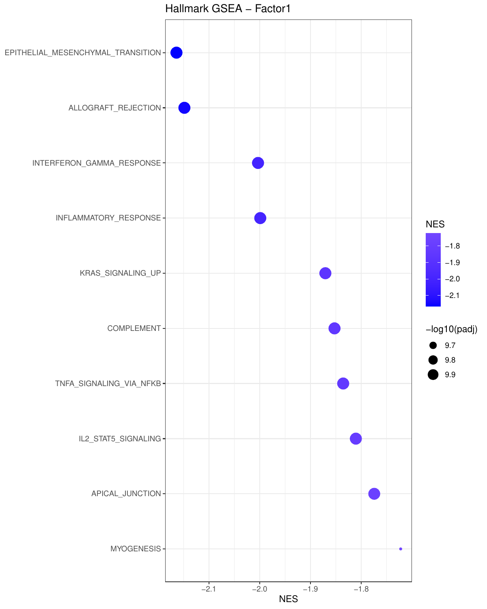
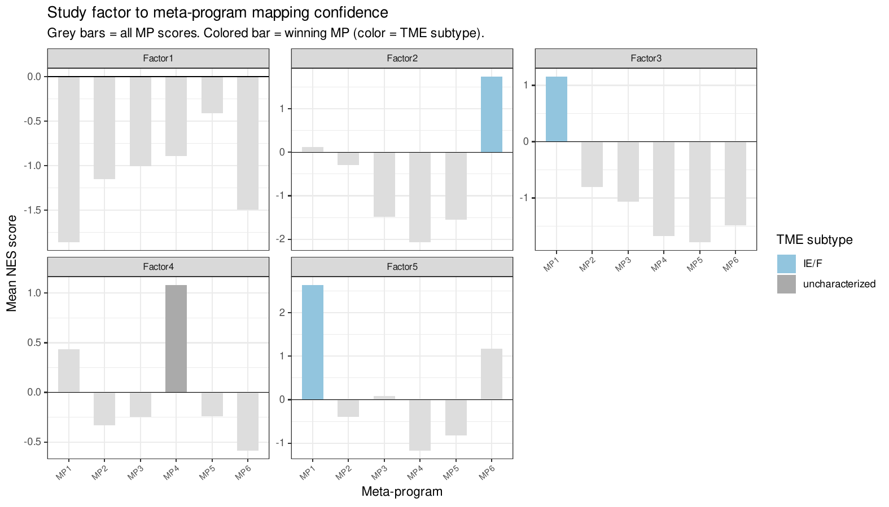

```{r, include = FALSE}
knitr::opts_chunk$set(
  collapse = TRUE,
  comment = "#>"
)
```

```{r setup}
library(CellTFusion)
```

Once latent factors have been extracted (see [Cell groups and latent factors](a2_cell_groups.html)), each factor can be linked to known biological programs:

1. **Hallmark GSEA** — associate each factor with MSigDB Hallmark gene sets.
2. **Meta-program mapping** — match each factor to cancer type-specific reference programs derived from TCGA.
3. **TME subtype annotation** — relate factors to established TME subtypes.

These steps use:

- `counts.norm` — normalized expression matrix (genes x samples).
- `latent_spaces` — output of `compute.latent_factors()`; `latent_spaces$Z` is the samples x factors matrix.

## **Hallmark GSEA per latent factor**

`compute_factor_gsea()` fits a multivariate `limma` model with the latent factor scores as covariates, ranks genes by their moderated t-statistic for each factor, and runs a pre-ranked GSEA with `fgsea` [@Korotkevich2021] against the MSigDB Hallmark collection [@Liberzon2015]. The Hallmark collection summarizes about 50 well-defined biological processes (e.g. EMT, interferon response, hypoxia), a natural vocabulary to interpret data-driven factors. The samples of `features_df` must be in the same order as the columns of `RNA.tpm`.

```{r, eval = FALSE}
gsea_results <- compute_factor_gsea(
  RNA.tpm     = counts.norm,
  features_df = latent_spaces$Z,
  plot_dot    = TRUE,
  top_n       = 10,
  file_name   = "Tutorial"
)
```

| Element | Description |
| ------- | ----------- |
| `$DE_results` | Named list of `limma` results, one per factor |
| `$GSEA_results` | Named list of `fgsea` results, one per factor |

With `plot_dot = TRUE`, a dot plot of the top Hallmarks is saved per factor (dot size = significance, color = normalized enrichment score, NES):

```{r, echo = FALSE, out.width = "80%", fig.align = "center", fig.alt = "Dot plot of the top Hallmark gene sets for latent factor 1"}

```

## **Mapping factors to TCGA meta-programs**

### What are meta-programs?

A **meta-program (MP)** is a recurrent transcriptional program reflecting a cell state (e.g. cell cycle, hypoxia, epithelial-mesenchymal transition, interferon response) that recurs across tumors and cancer types. Gavish et al. [@Gavish2023] characterized such programs from single-cell RNA-seq across many cancers. `CellTFusion` follows the same logic with bulk TCGA data: it derives cancer type-specific meta-programs from TCGA, so that factors found in a new study can be described with a shared vocabulary of TME states.

### How `map_factors_to_metaprograms()` works

1. **Reference (pre-built, per cancer type):** `CellTFusion` was run on a TCGA cohort, and the Hallmarks were clustered by their NES profiles across the TCGA factors (`derive_meta_programs()`). Each resulting meta-program is a set of Hallmarks, annotated with a TME subtype (see below). References are shipped for `"blca"` (bladder cancer), `"luad"` (lung adenocarcinoma) and `"skcm"` (melanoma).
2. **Study factors:** the Hallmark NES of each study factor come from `compute_factor_gsea()`.
3. **Matching:** for each study factor and each meta-program, the mean NES of the meta-program's Hallmarks is computed. The meta-program with the highest positive mean NES is the factor's `best_MP`.

In other words: *which known program does this factor's Hallmark signature resemble most?*

```{r, eval = FALSE}
mp_mapping <- map_factors_to_metaprograms(
  gsea_study  = gsea_results,
  cancer_type = "skcm",
  plot        = TRUE,
  file_name   = "Tutorial"
)
```

| Element | Description |
| ------- | ----------- |
| `$factor_mapping` | One row per study factor: `factor`, `best_MP`, `best_score` (its mean NES), `all_scores` (mean NES for every meta-program) and `TME_subtype` of the best meta-program |
| `$reference` | The meta-program reference: `meta_program`, its `hallmarks` and `TME_subtype` |

A custom reference can be used with `mp_file`, either a data frame like `$reference` or the path to an `.RData` file containing an object named `meta_programs`.

With `plot = TRUE`, each panel shows a study factor: grey bars are the mean NES for every meta-program, and the best-matching one is colored by its TME subtype:

```{r, echo = FALSE, out.width = "90%", fig.align = "center", fig.alt = "Bar plots of mean NES per meta-program for each study factor, with the best match highlighted"}

```

## **TME subtypes**

`map_factors_to_TME()` uses the TCGA annotations of Bagaev et al. [@Bagaev2021], who defined four pan-cancer TME subtypes (Molecular Functional Portraits, MFP):

- **IE** (immune-enriched, non-fibrotic) — high immune infiltration, low stromal signal.
- **IE/F** (immune-enriched, fibrotic) — high immune infiltration with a fibrotic/stromal signature.
- **F** (fibrotic) — stroma-dominated, low immune infiltration.
- **D** (depleted) — low immune infiltration and low fibrosis.

These subtypes are associated with response to immune checkpoint blockade. For a TCGA cancer type, `map_factors_to_TME()` matches the TCGA patients in `Z` to their MFP subtype and tests each factor across the four subtypes with a Kruskal-Wallis test. Factors with p < 0.05 are labeled with the subtype that has the highest median score; the others are labeled `"uncharacterized"`. This is how the TME subtypes of the TCGA meta-program references were assigned (`annotate_metaprograms_TME()`).

```{r, eval = FALSE}
tme_annotation <- map_factors_to_TME(
  cancer_name = "skcm",
  Z           = latent_spaces$Z,   # TCGA samples x factors
  plot        = TRUE,
  file_name   = "Tutorial"
)
```

## **Deriving meta-programs**

To build your own reference, for example from several cohorts, `derive_meta_programs()` clusters the Hallmarks by their NES profiles across factors. The number of meta-programs `k` is chosen at the elbow of the within-cluster sum of squares if `NULL`.

```{r, eval = FALSE}
meta_programs <- derive_meta_programs(
  gsea_results = gsea_results,
  k            = NULL,
  file_name    = "Tutorial",
  plot         = TRUE
)
```

## **Running everything with `CellTFusion()`**

The GSEA and meta-program mapping are run by `CellTFusion()` when `cancer_type` is given:

```{r, eval = FALSE}
res <- CellTFusion(raw.counts = raw.counts, cancer_type = "skcm")

res$TME_states              # factor-to-meta-program mapping
res$Metaprograms_reference  # meta-program reference used
```

## References
