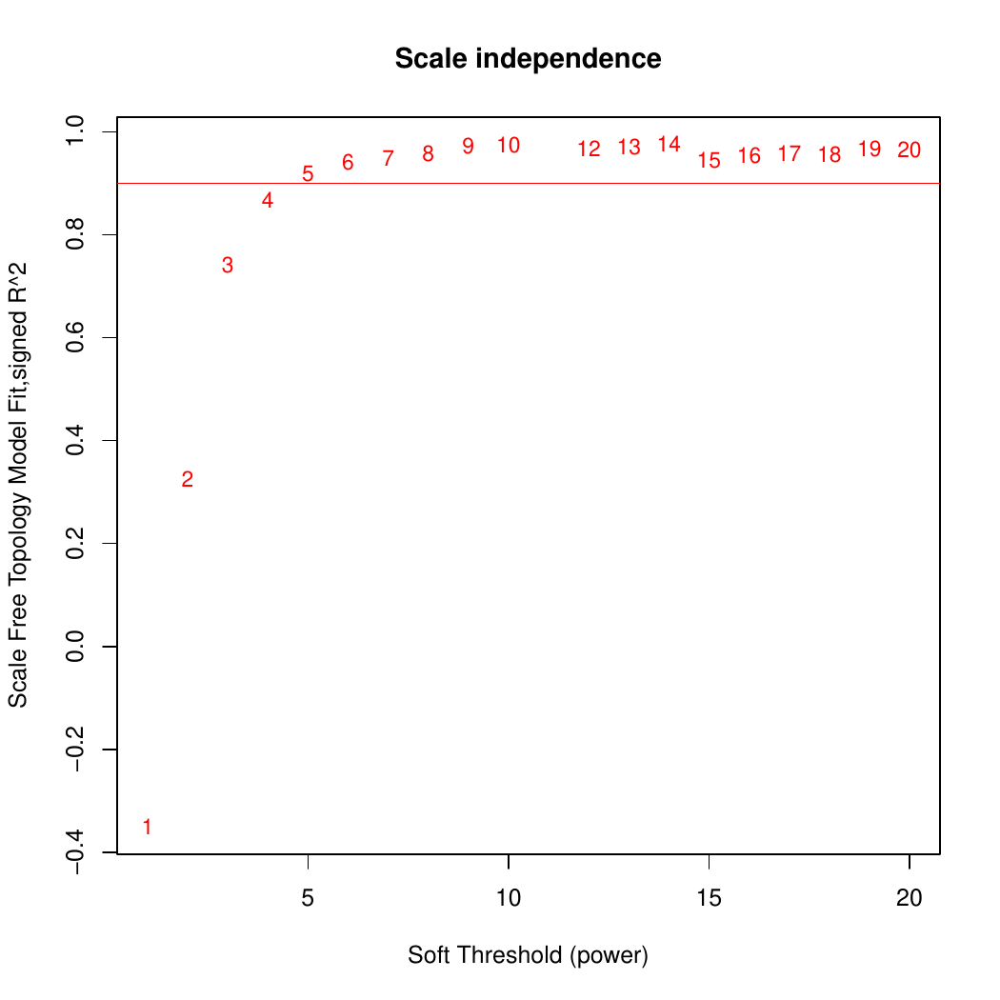
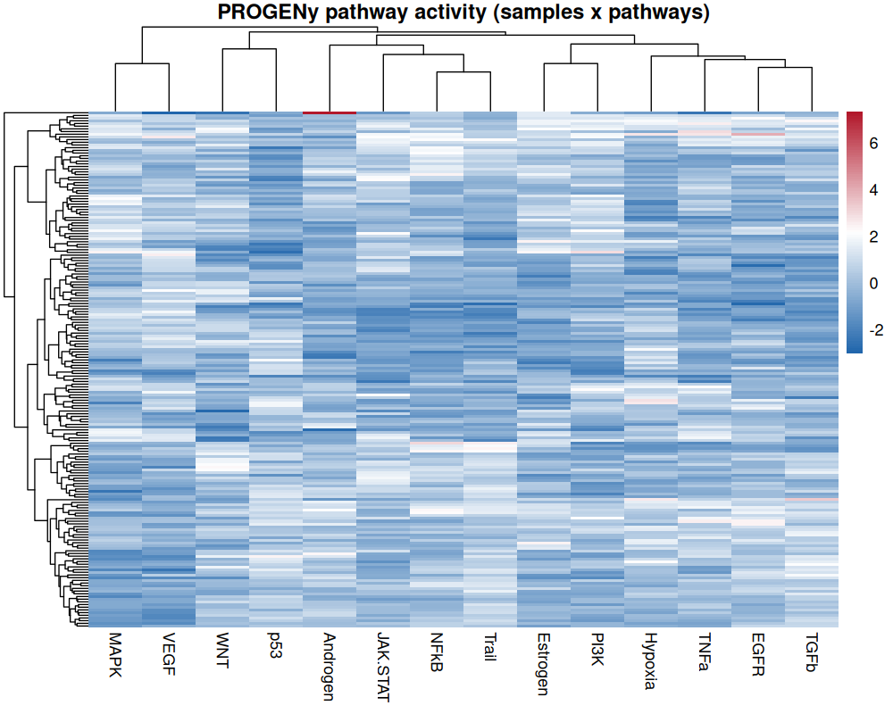
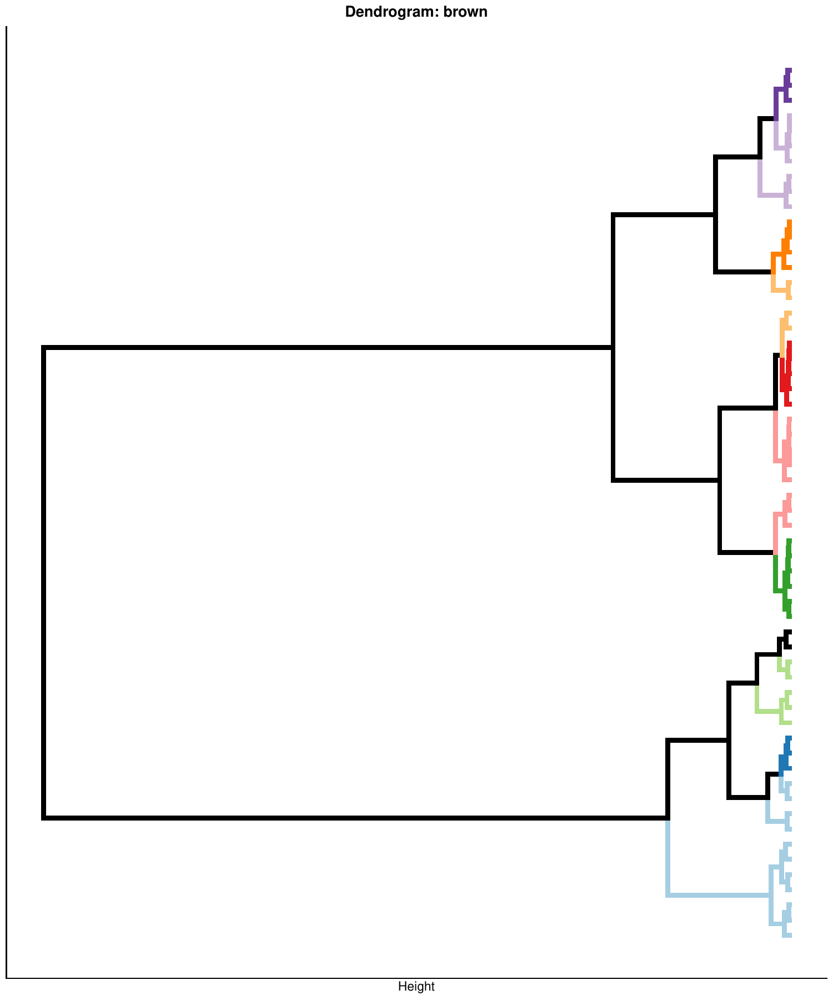

```{r, include = FALSE}
knitr::opts_chunk$set(collapse = TRUE, comment = "#>")
```

```{r setup}
library(CellTFusion)
```

CellTFusion combines two families of features computed from bulk RNAseq data: **cell-type deconvolution proportions** and **transcription factor (TF) activity scores**, further summarized into TF co-activity modules and pathway activities. This article walks through each function individually — what it does, its key arguments, and the plots/objects it produces. All of these steps are run automatically, in the right order, by the `CellTFusion()` wrapper (see the package [README](../index.html)); read this article if you want to run, inspect, or customize each stage on its own.

Load the pre-packaged example data:

```{r}
raw.counts <- CellTFusion::raw.counts.tuto
traitdata  <- CellTFusion::traitdata.tuto
```

## 1. Normalization

Before TF activity or pathway scoring, raw counts are normalized to log2(TPM + 1). Deconvolution methods use TPM without the log transform, and this step is handled internally by `compute.deconvolution()`.

```{r, eval = FALSE}
counts.norm <- data.frame(ADImpute::NormalizeTPM(raw.counts, log = TRUE))
```

## 2. Cell-type deconvolution

Cell-type proportions are estimated with `compute.deconvolution()` from the companion [`multideconv`](https://github.com/VeraPancaldiLab/multideconv) package, which wraps multiple deconvolution algorithms (Quantiseq, Epidish, DeconRNASeq, DWLS, CIBERSORTx) and averages/combines their outputs into a single feature matrix (samples x cell-type/method combinations).

Key arguments:

- `raw.counts` — raw counts matrix (genes x samples).
- `methods` — deconvolution algorithms to run.
- `normalized` — set to `TRUE` if `raw.counts` is already normalized (the function otherwise normalizes internally to TPM).
- `credentials.mail` / `credentials.token` — required only if `"CBSX"` (CIBERSORTx) is included in `methods`.
- `return` — if `TRUE`, saves the resulting matrix to `Results/`.

```{r}
deconv <- multideconv::compute.deconvolution(
  raw.counts,
  methods    = c("Quantiseq", "Epidish"),
  normalized = TRUE,
  return     = FALSE
)
head(deconv[, 1:5])
```

## 3. TF activity inference

TF activity per sample is inferred with `compute.TFs.activity()` from normalized expression using a VIPER/consensus-scoring approach (via `decoupleR`) [@Alvarez2016], combined with a regulon (TF-target network).

Key arguments:

- `RNA.counts` — normalized expression matrix (genes x samples), typically log2(TPM+1).
- `TF.collection` — source of the TF-target regulon:
  - `"CollecTRI"` (default) [@10.1093/nar/gkad841] and `"Dorothea"` are curated, literature-derived regulons fetched automatically from OmnipathR.
  - `"ARACNE"` uses a **data-driven, cohort-specific** regulatory network reverse-engineered from expression data with the ARACNe algorithm [@Margolin2006] (Algorithm for the Reconstruction of Accurate Cellular Networks), instead of a generic literature-derived network. ARACNe infers TF-target edges from mutual information between gene expression profiles across the cohort, followed by removal of indirect interactions via the Data Processing Inequality. This is useful when you have a large cohort of samples from the same cancer type/context and want TF-target relationships inferred directly from its co-expression structure rather than relying on curated interactions that may not hold in that tissue — at the cost of requiring a sizeable, homogeneous cohort to estimate mutual information reliably. It requires a pre-computed 3-column network file (`regulator`, `target`, `mutual information`) located at `input/ARACNE/<cancer.type>/network/network.txt`; pass the corresponding label via `cancer.type`.
- `min_targets_size` — minimum number of target genes required per regulon (TFs with fewer targets are dropped). Default is 5; increasing it keeps only better-supported TFs.
- `universe` — optional user-supplied regulon (data frame of TF-target interactions), bypassing the automatic OmnipathR/ARACNE fetch.
- `cores` — number of cores used for the activity inference.
- `scale` — if `TRUE` (default), z-scores TF activity across samples.

```{r, eval = FALSE}
tfs <- compute.TFs.activity(
  RNA.counts       = counts.norm,
  TF.collection    = "CollecTRI",
  min_targets_size = 5,
  cores            = 3,
  return           = TRUE
)
head(tfs[, 1:5])
```

You can also supply a pre-built regulon directly via `universe`:

```{r, eval = FALSE}
universe <- decoupleR::get_collectri(organism = "human", split_complexes = FALSE)
tfs <- compute.TFs.activity(counts.norm, universe = universe)
```

Or use a cohort-specific ARACNe network:

```{r, eval = FALSE}
tfs_aracne <- compute.TFs.activity(
  RNA.counts    = counts.norm,
  TF.collection = "ARACNE",
  cancer.type   = "skcm"   # matches input/ARACNE/skcm/network/network.txt
)
```

## 4. TF co-activity modules

TF activity scores (potentially hundreds of TFs) are reduced into a small number of co-activity **modules** using `compute.WTCNA()`, an implementation of Weighted TF Co-activity Network Analysis (WTCNA), an adaptation of WGCNA [@langfelder2008wgcna] applied to TFs instead of genes. Each module gets one sample-level score (its eigengene).

Key arguments:

- `TFs.matrix` — TF activity matrix (or, if `batch = TRUE`, a **list** of per-cohort matrices) from `compute.TFs.activity()`.
- `batch` — if `TRUE`, runs consensus WGCNA across cohorts instead of a single-matrix analysis (see the [Batch/Multi-cohort Analysis](07-batch-analysis.html) article for details).
- `network.type` — `"signed"` (default), `"unsigned"`, `"signed hybrid"`, or `"distance"`.
- `minMod` — minimum number of TFs required to form a module.
- `corr_mod` — correlation threshold for merging similar modules.
- `cor_type` — `"p"` (Pearson) or `"s"` (Spearman).

```{r, eval = FALSE}
network <- compute.WTCNA(
  TFs.matrix        = tfs,
  batch             = FALSE,
  network.type      = "signed",
  clustering.method = "ward.D2",
  minMod            = 15,
  corr_mod          = 0.9,
  return            = TRUE
)
```

When `return = TRUE`, this saves diagnostic plots to `Results/`. First, the scale-free topology fit used to pick the WGCNA soft-thresholding power:

```{r, echo = FALSE, out.width = "70%", fig.alt = "Scale-free topology model fit (signed R^2) versus soft-thresholding power for the WGCNA network"}

```

Then the TF clustering dendrogram, colored by module, before and after merging highly correlated modules:

```{r, echo = FALSE, out.width = "48%", fig.show = "hold", fig.alt = c("TF clustering dendrogram with module colors before merging", "TF clustering dendrogram with module colors after merging")}
knitr::include_graphics(c(
  "figures/gene_dendrogram_before_merging.png",
  "figures/gene_dendrogram_after_merging.png"
))
```

`network[[1]]` (`"TFs module matrix"`) holds the module eigengene scores (samples x modules) used downstream by `construct_cell_groups()`.

## 5. Pathway activity

Pathway activities are estimated with `compute.pathway.activity()`, using a multivariate linear model (MLM) via `decoupleR` [@10.1093/bioadv/vbac016], with PROGENy [@Schubert2018] as the default pathway database. If a custom `gene_sets` list is supplied, GSVA scoring is computed in addition to PROGENy.

Key arguments:

- `RNA.tpm` — normalized expression matrix (genes x samples).
- `gene_sets` — optional list of custom gene sets; if provided, GSVA scores are also returned.
- `paths` — optional custom PROGENy-style pathway-gene weight table; if `NULL`, the default human PROGENy model is used.

```{r, eval = FALSE}
pathways <- compute.pathway.activity(
  RNA.tpm = counts.norm,
  return  = TRUE
)
```

The result is a samples x pathways score matrix (14 PROGENy pathways by default). Clustering samples and pathways on this matrix gives a quick overview of which pathways co-vary across the cohort:

```{r, echo = FALSE, out.width = "80%", fig.alt = "Heatmap of PROGENy pathway activity scores clustered by sample and pathway"}

```

## 6. Deconvolution feature reduction

Deconvolution features from different methods/signatures are often highly correlated. `compute.deconvolution.analysis()` (from `multideconv`) groups correlated cell-type/method columns into **subgroups**, reducing redundancy and improving statistical power in later steps.

Key arguments:

- `deconvolution` — output of `compute.deconvolution()`.
- `corr` — minimum correlation to group features into the same subgroup.
- `corr_type` — `"spearman"` (default) or `"pearson"`.
- `batch` — optional batch/cohort vector; if provided, correlations are computed as partial correlations controlling for batch (see [Batch/Multi-cohort Analysis](07-batch-analysis.html)).

```{r, eval = FALSE}
dt <- multideconv::compute.deconvolution.analysis(
  deconvolution = deconv,
  corr          = 0.7,
  seed          = 123,
  return        = FALSE
)
```

## 7. Cell group construction

`construct_cell_groups()` combines the TF module network (`network`) and reduced deconvolution structure (`dt`) into composite **cell groups**: clusters of cell-type features whose abundance correlates with specific TF module activity. It correlates cell-type subgroups against TF modules, hierarchically clusters the significant pairs, and cuts the resulting dendrogram into cell groups.

```{r, eval = FALSE}
cell_groups <- construct_cell_groups(
  network = network,
  dt      = dt,
  pval    = 0.05
)
```

One dendrogram is produced per TF module, showing how its correlated cell-type features cluster into cell groups (colors indicate module membership of the underlying TF driving each branch):

```{r, echo = FALSE, out.width = "70%", fig.alt = "Dendrogram of cell-type features clustered into cell groups per TF module"}

```

See the [Cell Group Construction](02-cell-groups.html) article for full details, including the difference between unsupervised and supervised construction.

## 8. Latent factor extraction

Cell group scores are further compressed into a small set of non-negative matrix factorization (NMF) **latent factors**, a compact representation of the TME landscape used for downstream statistics and machine learning, via `compute.latent_factors()`. See the [Cell Group Construction](02-cell-groups.html) article for a full walkthrough.

## 9. Cell niche characterization

`compute_cells_niches()` characterizes each latent factor by identifying which cell types are enriched among the cell groups that contribute most to it. See the [Cell Group Construction](02-cell-groups.html) article for a full walkthrough.

## 10. Functional and meta-program annotation

`compute_factor_gsea()` and `map_factors_to_metaprograms()` functionally annotate latent factors via Hallmark GSEA and map them onto reference cancer meta-programs derived from TCGA. See the [TME State Characterisation](03-tme-states.html) article for a detailed walkthrough, including the biological rationale, references, and example plots behind meta-program mapping.

## Putting it together

Every function above is called, in this order, by `CellTFusion()`. Once you are comfortable with the individual building blocks, you normally do not need to run them manually — simply call:

```{r, eval = FALSE}
res <- CellTFusion(
  raw.counts     = raw.counts,
  normalized     = TRUE,
  coldata        = traitdata,
  task           = "unsupervised",
  deconv_methods = c("Quantiseq", "Epidish"),
  TF.collection  = "CollecTRI",
  cancer_type    = "skcm",
  corr           = 0.7,
  corr_mod       = 0.9,
  pval           = 0.05,
  file_name      = "Tutorial",
  return         = TRUE
)
```

`res` then contains every intermediate object described above (`$Deconvolution`, `$TFs_matrix`, `$TF_network`, `$Pathways_scores`, `$Processed_deconvolution`, `$Cell_groups`, `$Latent_spaces`, `$Cells_niches`, `$TME_states`, `$Metaprograms_reference`) — see the [README](../index.html) for the full output structure.

## References
