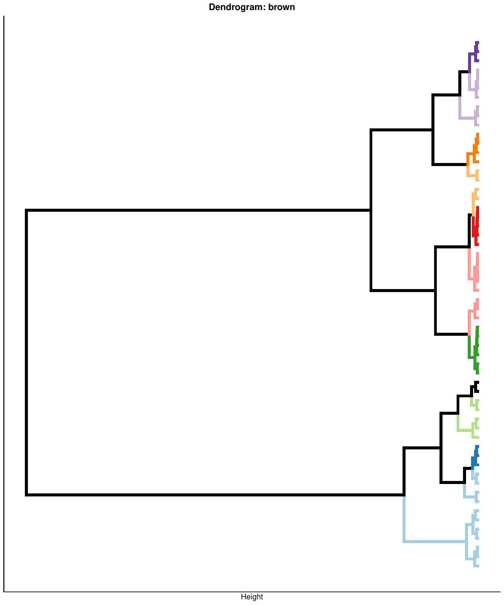
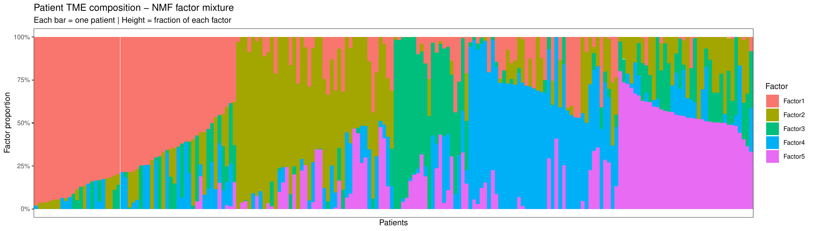
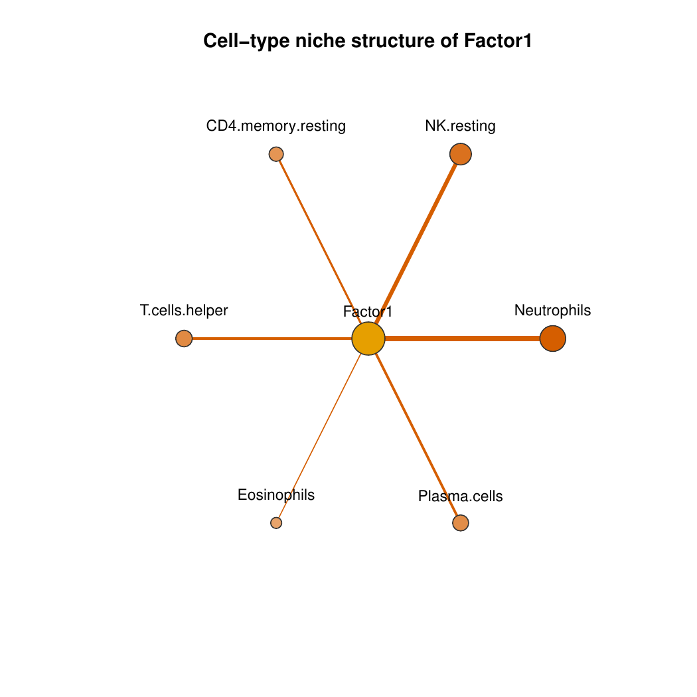

```{r, include = FALSE}
knitr::opts_chunk$set(collapse = TRUE, comment = "#>")
```

```{r setup}
library(CellTFusion)
```

This article covers the core analytical steps of CellTFusion: identifying cell groups from TF modules and deconvolution data, extracting latent factors, and deriving cell niches. These steps require outputs from the [Feature Computation](01-feature-computation.html) article:

- `network` — WTCNA TF modules from `compute.WTCNA()`
- `dt` — reduced deconvolution groups from `multideconv::compute.deconvolution.analysis()`
- `latent_spaces` — NMF latent factors from `compute.latent_factors()`

## Construct cell groups

Cell groups are identified by correlating TF module eigengenes with deconvolution subgroups and cutting the resulting dendrogram. The function takes only two primary inputs — `network` and `dt` — both produced in the feature computation step.

```{r, eval = FALSE}
cell_groups <- construct_cell_groups(
  network           = network,
  dt                = dt,
  batch             = NULL,          # pass batch vector if multi-cohort
  pval              = 0.05,
  clustering.method = "ward.D2",
  n_perm            = 999,
  dendrogram_file   = NULL,
  return_dendrogram = FALSE
)
```

For multi-cohort data, pass the same batch vector used in `compute.WTCNA()` and `compute.deconvolution.analysis()` — see the [Batch/Multi-cohort Analysis](07-batch-analysis.html) article:

```{r, eval = FALSE}
batch_vec   <- traitdata[, "Cohort"]
cell_groups <- construct_cell_groups(network, dt, batch = batch_vec, pval = 0.05)
```

### Re-running with precomputed features

`CellTFusion()` accepts precomputed `dt`, `tfs`, and `pathways` objects — e.g. those returned by a previous run (`res$Processed_deconvolution`, `res$TFs_matrix`, `res$Pathways_scores`). When all three are supplied, deconvolution, TF activity inference, and pathway scoring are all skipped and the pipeline proceeds straight to cell group construction. This is useful for quickly iterating on `construct_cell_groups()`-level parameters (`corr_mod`, `minMod`, `pval`, etc.) without recomputing upstream features:

```{r, eval = FALSE}
res <- CellTFusion(
  raw.counts = raw.counts,
  normalized = TRUE,
  coldata    = traitdata,
  return     = TRUE
)

# Re-run with different cell-group parameters, reusing the precomputed features
res_rerun <- CellTFusion(
  raw.counts = raw.counts,
  normalized = TRUE,
  coldata    = traitdata,
  dt         = res$Processed_deconvolution,
  tfs        = res$TFs_matrix,
  pathways   = res$Pathways_scores,
  corr_mod   = 0.25,
  minMod     = 20,
  pval       = 0.05,
  return     = TRUE
)
```

### Output structure

`construct_cell_groups()` returns a three-element list:

| Element | Description |
| ------- | ----------- |
| `[[1]]` | Data frame of composite scores (samples × cell groups) |
| `[[2]]` | Named list of cell-type compositions per group |
| `[[3]]` | Named list of TF loading vectors per group |

Results are also written to `Results/Cell.groups.composition.csv` and `Results/Cell.groups.scores.csv`. Passing `dendrogram_file` (and `return_dendrogram = TRUE`) additionally saves, per TF module, the dendrogram of correlated cell-type features that gets cut into cell groups:

```{r, echo = FALSE, out.width = "70%", fig.alt = "Dendrogram of cell-type features clustered into cell groups for one TF module"}

```

## Extract latent factors

Cell group scores are decomposed into NMF latent factors to obtain a compact, non-negative representation of the TME landscape. The `rank` argument controls the number of factors; if `NULL`, it is selected automatically.

```{r, eval = FALSE}
latent_spaces <- compute.latent_factors(
  X         = cell_groups[[1]],
  rank      = NULL,
  seed      = 123,
  file_name = "Tutorial",
  return    = TRUE
)
```

The result is a list whose `$Z` element is a samples × factors matrix — the primary input for downstream statistical tests and machine learning.

```{r, eval = FALSE}
# Access the factor scores matrix (samples x factors)
head(latent_spaces$Z)
```

When `return = TRUE`, a stacked bar plot summarizing each patient's mixture of latent factors is saved to `Results/`:

```{r, echo = FALSE, out.width = "90%", fig.alt = "Stacked bar plot of NMF latent factor proportions per patient"}

```

## Extract cell niches

Cell niches are derived from latent factors by enriching each factor for specific cell-type signals from the deconvolution output. This step characterises each latent factor with a biological cell-type context.

```{r, eval = FALSE}
cells_niches <- compute_cells_niches(
  latent_spaces   = latent_spaces,
  dt              = dt,
  cell.groups     = cell_groups,
  enrich_thresh   = 1.5,
  quantile_cutoff = 0.7,
  return          = TRUE,
  file_name       = "Tutorial"
)
```

For each enriched latent factor, a star-network plot is saved showing which cell types define its niche (edge width reflects enrichment strength):

```{r, echo = FALSE, out.width = "70%", fig.alt = "Star network showing cell types enriched in the niche of latent Factor1"}

```

## Next steps

With `latent_spaces` in hand, you can:

- **Characterise TME states** via GSEA and meta-program mapping → [TME States](03-tme-states.html)
- **Test clinical associations** of latent factors → [Statistical Analysis](04-analysis.html)
- **Train ML models** on `latent_spaces$Z` → [Machine Learning](06-machine-learning.html)
